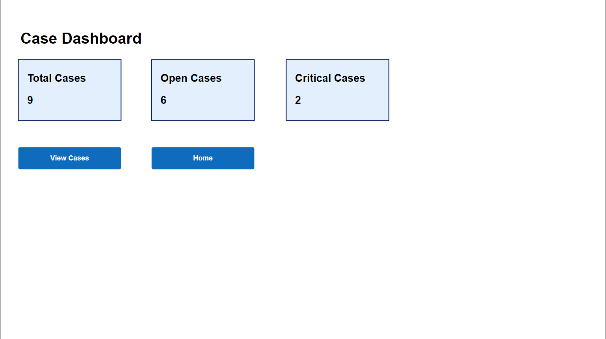

# PowerApps Case Management System

A case management application built with Microsoft Power Apps, Dataverse, and Power Automate.

## Features

- Create, view, edit, and delete support cases
- Store case data in Microsoft Dataverse
- Track case priority and status
- Dashboard displaying:
  - Total Cases
  - Open Cases
  - Critical Cases
- Automated email notifications for critical cases using Power Automate

## Technology Stack

- Microsoft Power Apps (Canvas App)
- Microsoft Dataverse
- Power Automate
- Office 365 Outlook

## Architecture

```text
Power Apps
    ↓
Dataverse
    ↓
Power Automate
    ↓
Email Notifications
```

## Screenshots

### Dashboard


### Case List


## Author

**Nasim Ahmed**

CRM Developer | Power Platform Portfolio Project
